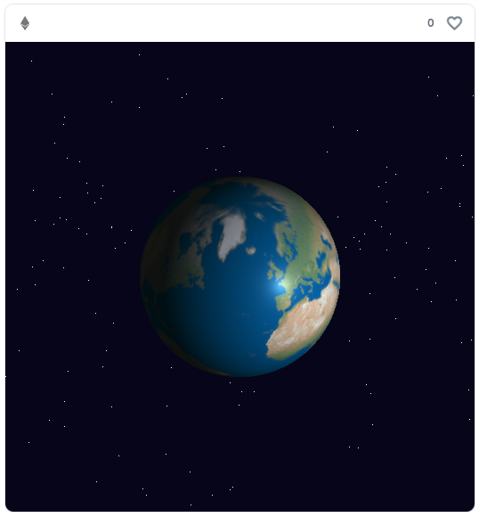

# On-chain Three.js PNG version

Sample code for Fully-on-chain NFT with Three.js, using PNG image compression instead of gzip.  
I referred to [ROSES](https://opensea.io/assets/ethereum/0x3e743377417cd7ca70dcc9bf08fac55664ed3181/1) by @dhof and
[RollerCoaster](https://testnets.opensea.io/assets/goerli/0xfccef97532caa9ddd6840a9c87843b8d491370fc/1) by @xtremetom.



Three.js, OrbitControls, and texture images are bundled into a single JavaScript file.

[Etherscan](https://goerli.etherscan.io/address/0xD9E57434632ec29Bb904a45E106657aE8d51B949#code)  
[OpenSea](https://testnets.opensea.io/ja/assets/goerli/0xd9e57434632ec29bb904a45e106657ae8d51b949/1)

## Setup

```sh
git clone https://github.com/NowAndNawoo/on-chain-threejs-png.git
cd on-chain-threejs-png
npm install
cp .env.sample .env
```

## Usage

### 1. Convert JS to PNG

Convert `html/Sample1/dist/bundle.js` to `output/sample1.png`.

```sh
npx hardhat run scripts/create-png.ts
```

### 2. Compress PNG

Compress `output/sample1.png` and save as `output/sample1.min.png`.

I converted the 471KB JS file to a 416KB PNG file using Jimp, then compressed it down to 127KB using [ImageOptim](https://imageoptim.com/mac).

### 3. Deploy and mint

Deploy the two contracts, upload Base64-encoded PNG and mint.

```sh
npx hardhat run scripts/deploy.ts --network goerli
```

## Links

- [RollerCoaster Source Code](https://goerli.etherscan.io/address/0xfccef97532caa9ddd6840a9c87843b8d491370fc#code)
- [ROSES Source Code](https://etherscan.io/address/0x3e743377417cd7ca70dcc9bf08fac55664ed3181#code)
- [Earth texture image (public domain)](https://www.shadedrelief.com/natural3/pages/textures.html)
